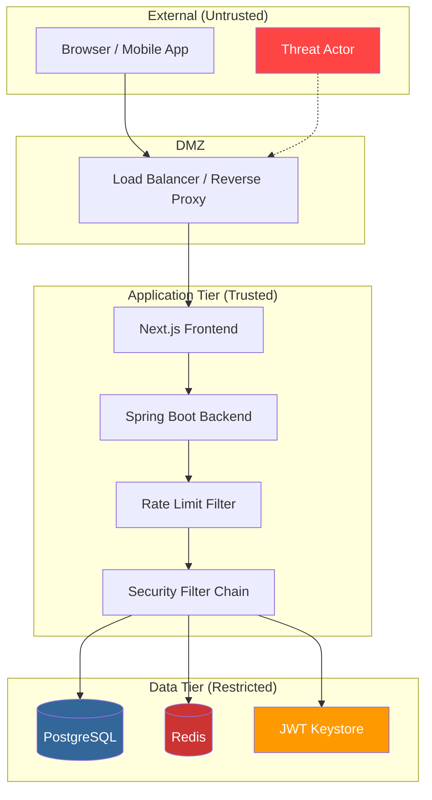

# UAE Digital Identity Platform — Threat Model

## STRIDE Analysis

| Threat | Category | Target | Mitigation | Status |
|--------|----------|--------|-----------|--------|
| Attacker impersonates user via stolen OTP | **S**poofing | OTP flow | OTP hashed (SHA-256), 3-min expiry, max 5 attempts, lockout after 3 cycles, Redis-backed counters | ✅ Implemented |
| Attacker reads PII from database | **I**nformation Disclosure | Users table | Emirates ID/email/phone stored as salted SHA-256 hashes; full name AES-256-GCM encrypted | ✅ Implemented |
| Attacker modifies audit log entries | **T**ampering | Audit logs | HMAC chain (each entry references previous hash), append-only table, no UPDATE/DELETE grants | ✅ Implemented |
| Attacker guesses user PIN | **S**poofing | PIN auth | Argon2id (64MB/3 iter) + server pepper, max 5 attempts, Redis lockout, complexity validation | ✅ Implemented |
| Attacker replays stolen refresh token | **R**epudiation | Token endpoint | One-time-use refresh tokens, Redis replay detection (`isTokenReplayed`), JTI tracking | ✅ Implemented |
| Attacker brute-forces OTP endpoint | **D**enial of Service | `/api/v1/otp/*` | Bucket4j per-IP (5/min) + per-user (3/min) rate limiting, progressive lockout | ✅ Implemented |
| Attacker hijacks session | **E**levation of Privilege | Session cookies | HttpOnly, Secure, SameSite=Strict, Redis-backed sessions, session fixation protection | ✅ Implemented |
| Attacker performs clickjacking | **T**ampering | All pages | X-Frame-Options: DENY, CSP frame-ancestors 'none' | ✅ Implemented |
| Attacker bypasses CORS | **E**levation of Privilege | API endpoints | Strict CORS allowlist (frontend origin only), credentials required | ✅ Implemented |
| Attacker exploits XSS | **I**nformation Disclosure | Frontend | CSP headers, no inline scripts, input sanitization | ✅ Implemented |

## Attack Surface Inventory

| Surface | Endpoints | Auth Required | Rate Limited |
|---------|-----------|---------------|--------------|
| Registration | `/api/v1/registration/*` | No | ✅ 10/min IP, per-user |
| OTP | `/api/v1/otp/*` | Session | ✅ 5/min IP, 3/min user |
| PIN | `/api/v1/pin/*` | Session | ✅ 5/min IP, 3/min user |
| OAuth2 | `/oauth2/authorize`, `/oauth2/token` | Client + User | ✅ 20/min, 10/min |
| User Info | `/api/v1/user/me` | JWT | No (auth-gated) |
| Admin Audit | `/api/v1/admin/audit` | JWT + ADMIN role | No (RBAC-gated) |
| Devices | `/api/v1/devices` | JWT | No (auth-gated) |
| Sessions | `/api/v1/sessions/revoke` | JWT | ✅ 10/min |
| JWK Set | `/oauth2/jwks` | None (public) | No |
| Health | `/actuator/health` | None | No |

## Trust Boundary Diagram

